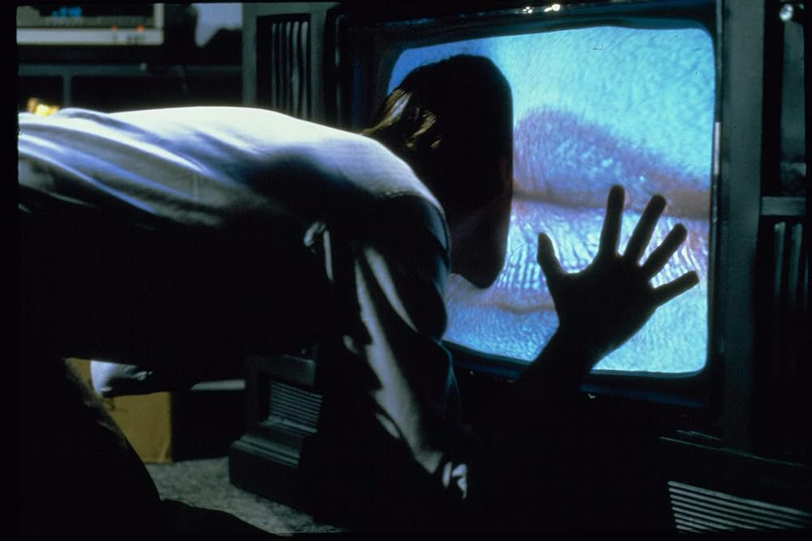

<!--
author: Moritz Riemann, Heike Behnke
email:  riemann@philsem.uni-kiel.de; behnke@philsem.uni-kiel.de
version: 0.1
language: en
narrator: UK English Female

\-->

# Einführung in die Medienethik II

Heike Behnke behnke@philsem.uni-kiel.de

Moritz Riemann riemann@philsem.uni-kiel.de

28. Mai 2025 und 2. Juni 2025

## Rückblende

Was erinnert Ihr aus dem ersten Semester?

[Conceptboard](https://app.conceptboard.com/board/qq7o-3dce-4cpd-nqhk-3ir5)

## Aktuelle Herausforderungen der Medienethik

### Welche Kanäle nutzt Ihr?

1. Wo informiert Ihr Euch worüber?
2. Wie überprüft Ihr, ob die Inhalte stimmen?
3. Wo netzwerkt Ihr?
4. Wem gehören die Medien und Netzwerke, die Ihr nutzt?

### Fake Content

(https://www.der-postillon.com/2019/11/ikea-kartoffeln.html)

Deep-Fakes sind insbesondere in Nachrichtenkontexten ein immenses Problem, stellen aber auch Fiktion und Kunst vor neue Fragen und Herausforderungen.

Warum?:

Fälschungen sind in jedem Medium so alt wie das Medium selbst - von den Hitlertagebüchern 1983 bis zum Varoufakis-Fake 2015 kamen alle Fakes ganz wunderbar ohne KI aus - , aber der Einsatz von Plattformen, die künstliche Intelligenz nutzen, macht sie allgemein verfügbar. Für die mediale Berichterstattung ist dies verheerend.

* Berichterstattung droht ihren Geltungsanspruch zu verlieren 

* Wahrhaftigkeit und Realitätstreue werden untergraben

* Affirmativität des Bildes ist letztlich Verantwortungsgegenstand

### Verantwortung

>"Für den Journalismus markiert der Verantwortungshorizont im Rahmen der Berichterstattung u.a. die Aufgaben einer Wahrheitsgetreuen Unterrichtung der Öffentlichkeit, die Sorgfaltspflicht, die Richtigstellung von Falschmeldungen, den Schutz der Privatsphäre, das Bestechungsverbot und die Wahrunbg des Berufsgeheimnisses [...]. Im Kontext medienethischer Debatten [stellt sich] unter anderem die Frage, wer die Verantwortung für moralisch fragwürdige Ausprägung der Berichterstattung besitzt. Dabei wird differenziert zwischen der Verantwortung der Akteure, die die Medienprodukte verteilen, sowie die der Mediennutzer [...]." (Schicha 2019, S. 30)

### Reichweitenverantwortung

Mit großer Reichweite kommt große Verantwortung:

* Habe ich als Hollywoodregisseur:in, Produzent:in, Schauspieler:in eine größere Verantwortung für meine Inhalte, weil ich mehr Menschen erreiche als etwa eine Arthouse-Produktion?

* Muss ich mich als öffentliche Person politisch positionieren?

  **Beispiel:**

  Abschaffung der Faktenchecks durch Meta, X, und andere Social-Media-Konzerne als Zugeständnis an und Ausdruck von autoritärer Politik

### Freiwillige Selbstkontrolle der Filmbranche

**Aus der Satzung der FSK:**

>(1) Die FSK hat die im Grundgesetz geschützten Werte, im Besonderen die verfassungsmäßige Ordnung und das Sittengesetz (Art. 2, Abs. 1 GG) sowie die in Art. 5 GG eingeräumte Freiheit zu beachten. Gesetzliche Grundlage für die Arbeit der FSK ist das Jugendschutzgesetz in der jeweils geltenden Form.

>(3) Maßgeblich für die Beurteilung ist die Wirkung des gesamten Films oder Trägermediums oder deren einzelner Teile. Bei einzelnen Teilen ist auch die Gesamtwirkung zu berücksichtigen. Die Prüfung eines Films oder Trägermediums darf nicht unter Gesichtspunkten des Geschmacks oder der persönlichen Anschauung erfolgen.

**Website des Medienrats Hamburg-Schleswig Holstein**

https://www.ma-hsh.de/aufsicht.html

Konzentration der inhaltlichen Kontrolle auf Jugendschutz

**Deutscher Ethikrat**

https://www.ethikrat.org/publikationen/stellungnahmen/mensch-und-maschine/

Konzentration auf KI und Technikethik

### AI in der Kreativbranche

In Kunstdiskursen wird zunehmend die Frage laut, ob künstlerische Tätigkeiten künftig durch AI-Modelle ausgeführt werden können.

Die Frage nach Autor:innenschaft stellt sich mit dem Einsatz textgenerierender Sprachmodelle neu in zwei zentralen Aspekten: 

1. Ist ein Text, der mit AI geschrieben wurde, noch eine künstlerische Leistung? 

2. Welche Auswirkungen auf die Form hat das Zusammenspiel von geschriebenem und generiertem Text?  

### These

>Rein KI-Generierte Kunst ist uninteressant, random, Durchschnitt im arithmetischen/algorithmischen Sinne Rekombination von bereits verhandenem und damit letztlich unkreativ.

### Mary Midgley (1919-2018)

>"Artificial Intelligence can, plainly, be immensely useful in practical contexts, providing new suggestions and checking old ones within formal systems which have a clear, fixed aim, such as chess, chemistry, or even areas as large as ecology and climatology, if the aims are really well specified. In areas where this is not so—where several different conceptual schemes are involved and especially where aims themselves come into question—its use seems to me much more obscure and its misuse more dangerous. If it does prove to be usable for somehow distinguishing among apparently promising ideas so as to tell us which of them will actually help us, that would be splendid. In that case, good luck to it. But this skill seems to demand a full appreciation of the various needs involved, which is something human beings have no idea how to acquire for themselves yet, and are not likely to be able to give to their programs." (Mary Midgley: Artificial Intelligence and Creativity. S. 141)

## Film, Genre und Körper

| | |
|---|---|
|||
|(Call me by your name, 2017)|(Portrait de la jeune fille en feu, 2019)|

### Sex, Gewalt, Emotion

(The Shining, 1980)

In dem Aufsatz „Film Bodies: Gender, Genre and Excess“ unterscheidet die feministische Medientheoretikerin Linda Williams drei verschiedene Formen des „Body Genres“, Filmgenres, die körperliche Extremsituationen darstellen. Der Pornofilm zeigt expliziten Sex, der Horrorfilm explizite körperliche Gewalt, das Melodrama explizite und exzessive Emotionen mit Hang zum Pathos. Williams schreibt:

>„Alone or in combination, heavy doses of sex, violence, and emotion are dismissed by one faction or another as having no logic or reason for existence beyond their power to excite. Gratuitous sex, gratuitous violence and terror, gratuitous emotion are frequent epithets hurled at the phenomenon of the‘sensational in pornography, horror, and melodrama.“

### Reaktion und Ablehnung

Während Sex, Gewalt und Emotionen natürlich auch in anderen Genres dargestellt werden, haben die Body Genres zwei Dinge gemein: Zum einen zielen Sie auf eine mehr oder weniger freiwillige körperliche Reaktion beim Publikum ab. Ich sage mehr oder weniger freiwillig, weil man diese Genres durchaus mit dem Ziel rezipiert, sich seinem eigenen Körper auszuliefern, in der Erregung, in der Angst, im Weinen. Zum anderen haben alle drei ein besonders abgründiges Verhältnis zu Geschlecht, sei es zum vergeschlechtlichten Körper allgemein und zum cis weiblichen Körper im Besonderen. Ob zufällig oder nicht sind diese drei Genres kulturell auch nicht besonders hoch angesehen.

(Fences, 2016)

>“The body spectacle is featured most sensationally in pornography’s portrayal of orgasm, in horror’s portrayal of violence and terror, and in melodrama’s portrayal of weeping.” (Linda Williams, Film Bodies: Gender, Genre and Excess, 1991)

- Das Abzielen auf spezifische körperliche Reaktionen ist bei der Bewertung miteinzubeziehen
- Da Bilder nicht negieren können, können Auseinandersetzungen mit Gewalt oft nicht ohne Gewaltdarstellungen auskommen
- Unterschiedliche Bewertung der Zustände vor und hinter der Kamera

>Auch, wenn Sie selbst keine Bodygenrefilme machen, kann jede Ihrer Arbeiten Elemente der Bodygenres enthalten. Diese erfordern in der Konzeption und Umsetzung besondere Aufmerksamkeit.

### Erotik/Pornographie

(Eyes Wide Shut, 1999)

**In der Produktion:**

Intimitätskoordination in Film- und Theaterproduktionen seit 2015

Offenes vs. Geschlossenes Set

**Auf der Leinwand:**

* Was *soll* die Szene evozieren?

* Was *kann* die Szene evozieren?

* Welche *Perspektiven* gibt es auf die Szene?

* Welche *Perspektiven* gibt die Szene *vor*?

* In welche Diskurse schreibe ich mich ein?

### Horror/Gewalt/Angst

(Susperia, 1977)

**In der Produktion:**

* Grenzen bestimmen 

* Emotionale Vorbereitung, Begleitung und Nachbereitung

* Bezugspersonen einsetzen 

**Auf der Leinwand:**

* Was *soll* die Szene evozieren?

* Was *kann* die Szene evozieren?

* Welche *Perspektiven* gibt es auf die Szene?

* Welche *Perspektiven* gibt die Szene *vor*?

* In welche Diskurse schreibe ich mich ein?

### Emotionaler Kontrollverlust

(Revolutionary Road, 2008)

**In der Produktion:**

* Grenzen bestimmen 

* Emotionale Vorbereitung, Begleitung und Nachbereitung

* Bezugspersonen einsetzen 

**Auf der Leinwand:**

* Was *soll* die Szene evozieren?

* Was *kann* die Szene evozieren?

* Welche *Perspektiven* gibt es auf die Szene?

* Welche *Perspektiven* gibt die Szene *vor*?

* In welche Diskurse schreibe ich mich ein?

### Das kreative Genie?    

## Break-Out Session

1. Sprecht miteinander über Eure aktuellen Projekte und deren ethische Herausforderungen! (15min)

2. Stellt die Ergebnisse kurz im Plenum vor! (2-3min pro Gruppe)

3. Abschließende Diskussion im Plenum.

## Literaturhinweise und Empfehlungen

Funiok, Rüdiger: Medienethik. Verantwortung in der Mediengesellschaft. Stuttgart: Kohlhammer 2007.

Mersch, Dieter: Medientheorien zur Einführung. Hamburg: Junius 2006

Midgley, Mary: Utopias, Dolphins, and Computers. London 2000.

Rusch, Gebhard u.a.: Theorien der Neuen Medien. Kino - Radio - Fernsehen - Computer. Paderborn: Fink
(UTB) 2007

Schicha, Christian: Medienethik. Grundlagen – Anwendungen – Ressourcen (utb) 2019

Williams, Linda: Film Bodies: Gender, Genre and Excess. Film Quarterly, Vol. 44, No. 4 (Summer, 1991), pp. 2-13. 

Ziemann, Andreas (Hg.):  Grundlagentexte der Medienkultur. Ein Reader. Wiebaden: Springer 2019.
